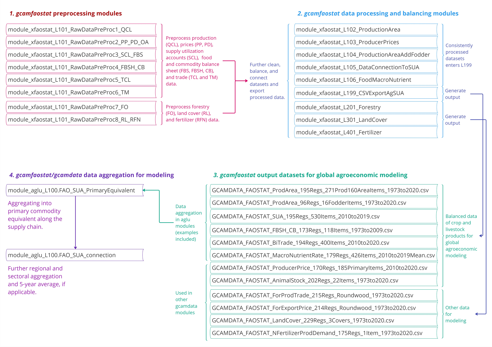

<!-- badges: start -->

<!-- badges: end -->

### **`gcamfaostat`**: An R package to prepare, process, and synthesize FAOSTAT data for global agroeconomic and multisector dynamic modeling

### Summary

The **`gcamfaostat`** R package is designed for the preparation, processing, and synthesis of the Food and Agriculture Organization (FAO) Statistics ([FAOSTAT](https://www.fao.org/faostat/en/#data)) agroeconomic data. The primary purpose is to facilitate FAOSTAT data use in global economic and multisector dynamic models while ensuring transparency, traceability, and reproducibility. Here, we provide an overview of the development of **`gcamfaostat`** (v1.0.0) and demonstrate its capabilities in generating and maintaining agroeconomic data required for the Global Change Analysis Model ([GCAM](https://jgcri.github.io/gcam-doc/toc.html)). Our initiative seeks to enhance the quality and accessibility of data for the global agroeconomic modeling community, with the aim of fostering more robust and harmonized outcomes in a collaborative, efficient, and open-source framework. One of the important features of the package is the possibility to construct the FAO Food Balance Sheets at the disaggregated commodity level (with over 500 commodities), which provides a comprehensive and detailed data input for a variety of analytical and modeling applications. The processed data and visualizations offered by **`gcamfaostat`** can also be valuable to a broader audience interested in gaining insights into the intricacies of global agriculture.

This tool bridges a crucial gap in the literature by offering several key features and capabilities.  

1.	**Transparency and Reproducibility**: **`gcamfaostat`** incorporates functions for downloading, cleaning, synthesizing, and balancing agroeconomic datasets in a traceable, transparent, and reproducible manner. This enhances the credibility of the processing and allows for better scrutiny of the methods. We have documented and demonstrated the use of the package in generating and updating agroeconomic data needed for the GCAM.  
2.	**Expandability and Consistency**: **`gcamfaostat`** can be used to flexibly process and update agroeconomic data for any agroeconomic model. The package framework can be also easily expanded to include new modules for consistently processing new data.          
3.	**Community Collaboration and Efficiency**: The package provides an open-source platform for researchers to continually enhance the processing methods. This collaborative approach, which establishes a standardized and streamlined process for data preparation and processing, carries benefits that extend to all modeling groups. By reducing the effort required for data processing and fostering harmonized base data calibration, it contributes to a reduction in modeling uncertainty and enhances the overall research efficiency.    
4.	**User Accessibility**: Where applicable, the processed data can be mapped and aggregated to user-specified regions and sectors for agroeconomic modeling. However, beyond the modeling community, **`gcamfaostat`** can be valuable to a broader range of users interested in understanding global agriculture trends and dynamics, as it provides user-friendly data processing and visualization tools.  

***

### User Guide
The package is documented in the [online manual](https://jgcri.github.io/gcamfaostat/index.html).

* [Getting Started](https://jgcri.github.io/gcamfaostat/articles/vignette_getting_started.html)
  * [Preparing Data](https://jgcri.github.io/gcamfaostat/articles/vignette_preparing_data.html)
  * [Processing Flow](https://jgcri.github.io/gcamfaostat/articles/vignette_processing_flow.html)
  * [Use Cases](https://jgcri.github.io/gcamfaostat/articles/vignette_use_cases.html) 
* [Functions](https://jgcri.github.io/gcamfaostat/reference/index.html)
* [Visualization](https://jgcri.github.io/gcamfaostat/articles/vignette_visualization.html)
* [News](https://jgcri.github.io/gcamfaostat/articles/vignette_news.html)

***

### Quick Start in R (> 4.0) & Rstudio

#### 1. Download and install (size < 1 GB):

* On the command line: navigate to your desired folder location and then enter 
* `git clone https://github.com/JGCRI/gcamfaostat.git`

#### 2. Load and run the gcamdata package

* Open the `gcamfaostat.Rproj` file in the `gcamfaostat` folder using RStudio.
* Load the `gcamdata` package:
* `devtools::load_all()`

#### 3. Modify configurations
* To export csv output files, in `constants.R`, 
  * set `OUTPUT_Export_CSV` to `TRUE`
  * specify the directory path (`DIR_OUTPUT_CSV`) for output files.

#### 4. Run the driver
* `driver_drake()` 

#### 5. Use data and package functions
* Data saved in `DIR_OUTPUT_CSV` can be used in downstream models.
* Once `drive_drake` has been run, all the intermediate data are saved and can be explored (see examples in [Use Cases](https://jgcri.github.io/gcamfaostat/articles/vignette_use_cases.html) and [Visualization](https://jgcri.github.io/gcamfaostat/articles/vignette_visualization.html).

***

### Package structure

* **`gcamfaostat`** processes [input data](https://jgcri.github.io/gcamfaostat/articles/vignette_preparing_data.html#metadata) to output data in a format that is needed for downstream processing and modeling, e.g., [data used in gcamdata-aglu-FAO](https://github.com/JGCRI/gcam-core/tree/master/input/gcamdata/inst/extdata/aglu/FAO) (see the schematic below).
* Input data was stored in the [Prebuilt Data](https://github.com/JGCRI/gcamfaostat/blob/main/data/PREBUILT_DATA.rda) of the package. The raw data is archived on Zenodo (see Zhao (2022) and URL in the [`FF_download_RemoteArchive`](https://github.com/JGCRI/gcamfaostat/blob/main/R/xfaostat_helper_funcs.R#L144) function) to ensure the processing is 100% replicable. Users can also download the latest data using [`FF_download_FAOSTAT`](https://github.com/JGCRI/gcamfaostat/blob/main/R/xfaostat_helper_funcs.R#90). 
* All intermediate processing and data flows are transparent and traceable. See [Processing Flow](https://jgcri.github.io/gcamfaostat/articles/vignette_processing_flow.html) for data-tracing examples. 

Schematic: module (data processing chunk) structure of gcamfaostat

***
    
### Future work and contribution

Data development is never a once and for all task, and continued efforts are needed to sustain and improve the processing procedures. Further improvements might include:  

1.	**Sustain processing functions for updated raw data**: ensuring that our processing functions remain up-to-date when raw data undergoes revisions is imperative.  
2.	**Evaluate and enhance assumptions**: a critical examination of the assumptions utilized in processes like interpolation, extrapolation, aggregation, disaggregation, and mapping is essential and should be an ongoing endeavor.  
3.	**Revise assumptions in low-quality data zones**: regions and sectors with little or low-quality data require careful consideration. We will need to adjust our assumptions when improved data becomes available.  
4.	**Promoting broader applications**: leveraging data processed by gcamfaostat can significantly contribute to harmonizing input data in global agroeconomic modeling. Encouraging the utilization of this data and fostering collaboration to enhance data processing is crucial.  
5.	**Assess sensitivity in downstream applications**: understanding the sensitivity of downstream data applications, e.g., global agroeconomic projections, to upstream data processing assumptions is crucial. This awareness empowers us to make informed decisions and refinements.  
  
We welcome and value community contributions to gcamfaostat. Please read our [Contributing Guidelines](CONTRIBUTING.md) for information on how to contribute to this package. Through collective and collaborative efforts, we hope to improve the interface between raw data, modeling community, and broader audience. We would be grateful for the feedback and suggestions on potential improvements of the developed data processing framework.

***

### Related publications  
- Bond-Lamberty, Ben, Kalyn Dorheim, Ryna Cui, Russell Horowitz, Abigail Snyder, Katherine Calvin, Leyang Feng et al. "gcamdata: An R package for preparation, synthesis, and tracking of input data for the GCAM integrated human-earth systems model." Journal of Open Research Software 7, no. 1 (2019). DOI: 10.5334/jors.232
- Calvin, Katherine V., Abigail Snyder, Xin Zhao, and Marshall Wise. "Modeling land use and land cover change: using a hindcast to estimate economic parameters in gcamland v2. 0." Geoscientific Model Development 15, no. 2 (2022): 429-447. https://doi.org/10.5194/gmd-15-429-2022
- Chepeliev, Maksym. "Incorporating nutritional accounts to the GTAP Data Base." Journal of Global Economic Analysis 7, no. 1 (2022): 1-43. https://doi.org/10.21642/JGEA.070101AF 
- Narayan et al., (2021). ambrosia: An R package for calculating and analyzing food demand that is responsive to changing incomes and prices. Journal of Open Source Software, 6(59), 2890. https://doi.org/10.21105/joss.02890
- Zhao, Xin, Katherine V. Calvin, Marshall A. Wise, and Gokul Iyer. "The role of global agricultural market integration in multiregional economic modeling: Using hindcast experiments to validate an Armington model." Economic Analysis and Policy 72 (2021): 1-17. https://doi.org/10.1016/j.eap.2021.07.007
- Zhao, Xin and Marshall Wise. "Core Model Proposal# 360: GCAM agriculture and land use (AgLU) data and method updates: connecting land hectares to food calories." PNNL https://jgcri.github.io/gcam-doc/cmp/CMP_360-AgLU_data_method_updates.pdf 
- Zhao, Xin (2022). FAOSTAT AgLU data Archive GCAMv7 (1.0) [Data set]. Zenodo. https://doi.org/10.5281/zenodo.8260225

Copyright 2023 Battelle Memorial Institute; see the LICENSE file.
