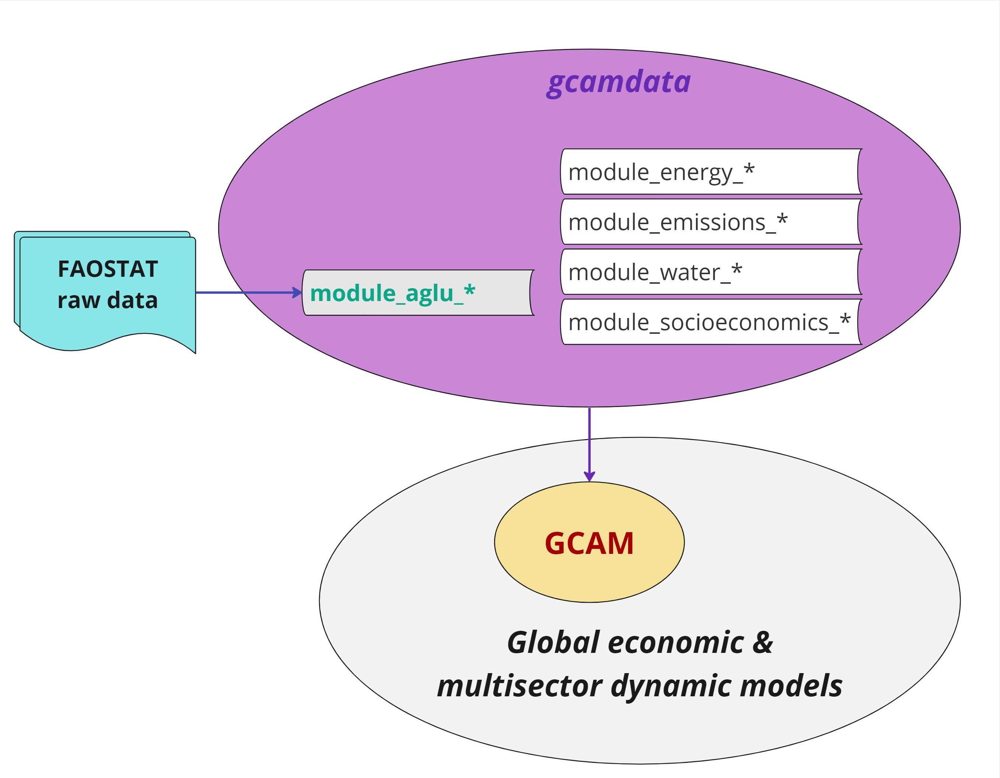
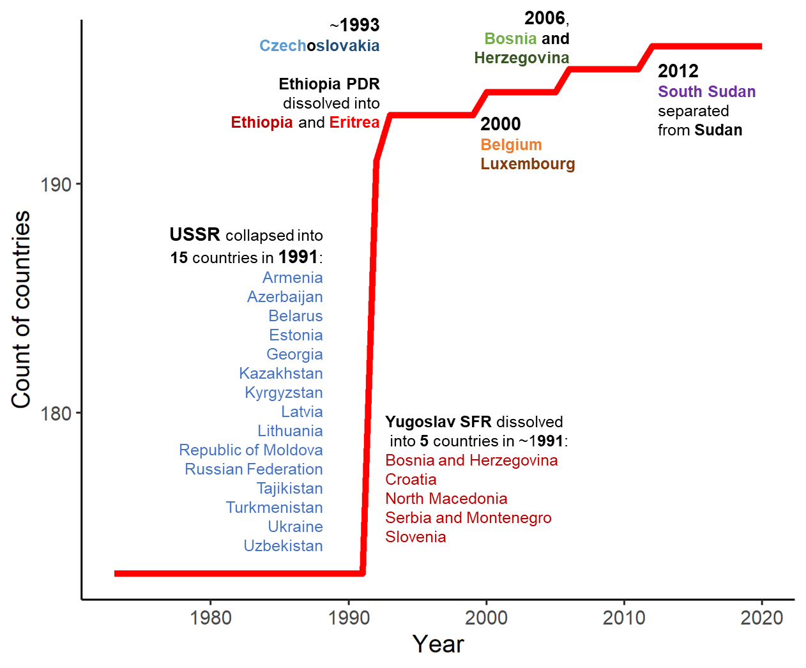

# Summary

The **`gcamfaostat`** R package is designed for the preparation, processing, and synthesis of the Food and Agriculture Organization (FAO) Statistics ([FAOSTAT](https://www.fao.org/faostat/en/#data)) agroeconomic data. The primary purpose is to facilitate FAOSTAT data use in global economic and multisector dynamic models while ensuring transparency, traceability, and reproducibility. Here, we provide an overview of the development of **`gcamfaostat v1.0.0`** and demonstrate its capabilities in generating and maintaining agroeconomic data required for the Global Change Analysis Model ([GCAM](https://jgcri.github.io/gcam-doc/toc.html)). Our initiative seeks to enhance the quality and accessibility of data for the global agroeconomic modeling community, with the aim of fostering more robust and harmonized outcomes in a collaborative, efficient, and open-source framework. One of the important features of the package is the possibility to construct the FAO Food Balance Sheets at the disaggregated commodity level (with over 500 commodities), which provides a comprehensive and detailed data input for a variety of analytical and modeling applications. The processed data and visualizations offered by **`gcamfaostat`** can also be valuable to a broader audience interested in gaining insights into the intricacies of global agriculture.

# Statement of need

Global economic and multisector dynamic models have become pivotal tools for investigating complex interactions between human activities and the environment, as evident in recent research [@Doelman2022Quantifying;@Fujimori2022Land-based;@Ven2023multimodel]. Agriculture and land use (AgLU) plays a critical role in these models, particularly when used to address key agroeconomic questions [@Graham2023Agricultural;@Yarlagadda2023Trade;@Zhang2023Agriculture;@Zhao2021Global;@Zhao2020critical]. Sound economic modeling hinges significantly upon the accessibility and quality of data [@Bruckner2019FABIO;@Calvin2022GMD;@Chepeliev2022JGEA]. The FAOSTAT serves as one of the key global data sources, offering open-access data on country-level agricultural production, land use, trade, food consumption, nutrient content, prices, and more [@FAOSTAT2023FAOSTAT]. However, the raw data from FAOSTAT requires cleaning, balancing, and synthesis, involving assumptions such as interpolation and mapping, which can introduce uncertainties. In addition, some of the core datasets reported by FAOSTAT, such as FAO’s Food Balance Sheets (FBS), are compiled at a specific level of aggregation, combining together primary and processed commodities (e.g., wheat and flour), which creates additional data processing challenges for the agroeconomic modeling community [@Chepeliev2022JGEA]. It is noteworthy that each agroeconomic modeling team typically develops its own assumptions and methods to prepare and process FAOSTAT data [@bond2019gcamdata]. While largely overlooked, the uncertainty in the base data calibration approach likely contribute to the disparities in model outcomes [@Lampe2014AgMIP;@zhao2021role]. Hence, our motivation is to create an open-source tool (**`gcamfaostat`**) for the preparation, processing, and synthesis of FAOSTAT data for global agroeconomic modeling. This tool bridges a crucial gap in the literature by offering several key features and capabilities.

1.	**Transparency and Reproducibility**: **`gcamfaostat`** incorporates functions for downloading, cleaning, synthesizing, and balancing agroeconomic datasets in a traceable, transparent, and reproducible manner [@wilkinson_fair_2016]. This enhances the credibility of the processing and allows for better scrutiny of the methods. We have documented and demonstrated the use of the package in generating and updating agroeconomic data needed for GCAM v7 [@bond_lamberty_2023].  
2.	**Expandability and Consistency**: **`gcamfaostat`** can be used to flexibly process and update agroeconomic data for any agroeconomic model. The package framework can be also easily expanded to include new modules for consistently processing new data.          
3.	**Community Collaboration and Efficiency**: The package provides an open-source platform for researchers to continually enhance the processing methods. This collaborative approach, which establishes a standardized and streamlined process for data preparation and processing, carries benefits that extend to all modeling groups. By reducing the effort required for data processing and fostering harmonized base data calibration, it contributes to a reduction in modeling uncertainty and enhances the overall research efficiency.    
4.	**User Accessibility**: Where applicable, the processed data can be mapped and aggregated to user-specified regions and sectors for agroeconomic modeling. However, beyond the modeling community, **`gcamfaostat`** can be valuable to a broader range of users interested in understanding global agriculture trends and dynamics, as it provides user-friendly data processing and visualization tools. 

# Design and Functionality

## Bridging the gap between FAOSTAT and global economic modeling

\autoref{fig:Fig1} shows a standard framework of using FAOSTAT data in GCAM. GCAM is a widely recognized global economic and multisector dynamic model complemented by the `gcamdata` R package, which serves as its data processing system. Particularly, `gcamdata` includes modules (data processing chunks) and functions to convert raw data inputs into hundreds of XML input files used by GCAM [@bond2019gcamdata]. As an illustration, in the latest GCAM version, GCAM v7 [@bond_lamberty_2023], about 280 XML files, with a combined size of 4.1 GB, are generated. Although AgLU-related XMLs represent only about 10% of the total number of files, they contribute over 50% in size (~2.1 GB). The majority of AgLU-related data, whether directly or indirectly, rely on raw data sourced from FAOSTAT. 

Nonetheless, the FAOSTAT data employed within `gcamdata` has traditionally involved manual downloads and may have undergone preprocessing. In light of the increasing data needs, maintaining the FAOSTAT data processing tasks in `gcamdata` has become increasingly challenging. In addition, the processing of FAOSTAT data in the AgLU modules of `gcamdata` is tailored specifically for GCAM. Consequently, the integration of FAOSTAT data updates has proven to be a non-trivial task, and the data processed by the AgLU module has limited applicability in other modeling contexts [@zhao_cmp360]. The **`gcamfaostat`** package aims to address these limitations (\autoref{fig:Fig2}). The targeted approach incorporates data preparation, processing, and synthesis capabilities within a dedicated package, **`gcamfaostat`**, while regional and sectoral aggregation functions in the model data system are implemented using standalone routines within the `gcamdata` package. This strategy not only ensures the streamlined operation of **`gcamfaostat`** but also contributes to keeping model data system lightweight and more straightforward to maintain.  
  
{width=70%}  

{width=70%} 

## Key functions 

In this section we describe key functions included in **`gcamfaostat (v1.0.0)`**. More details about the functions and documentations can be found in the online [**User Guide**](https://jgcri.github.io/gcamfaostat/index.html). 

### Data preparation 

**`gcamfaostat`** includes functions to generate metadata (`gcamfaostat_metadata`) and download FAOSTAT raw data from either a remote archive (`FF_download_RemoteArchive`) or directly from FAOSTAT (`FF_download_FAOSTAT`).  

[`gcamfaostat_metadata()`](https://jgcri.github.io/gcamfaostat/reference/gcamfaostat_metadata.html)  

* The function accesses both the latest FAOSTAT metadata and local data information and returns a summary table including the dataset information needed for **`gcamfaostat`** (see [Table 1](#Tab1) below).
* The function will save the latest FAOSTAT metadata to the [metadata_log](https://github.com/JGCRI/gcamfaostat/tree/main/inst/extdata/aglu/FAO/FAOSTAT/metadata_log)
* The dataset code needed were specified in the function to get a subset of the FAOSTAT metadata. The function will return only dataset code required when setting `OnlyReturnDatasetCodeRequired = FALSE`. 
* The function will check whether FAOSTAT raw data exists locally (`Exist_Local`) and in [Prebuilt Data](https://github.com/JGCRI/gcamfaostat/blob/main/data/PREBUILT_DATA.rda) (`Exist_Prebuilt`). If `Exist_Prebuilt` is `TRUE` for all dataset, the package is ready to be built based on the Prebuilt package data.
* `FAO update data` and `FAO size` indicate the information based on the latest FAOSTAT metadata.  

[`FF_download_RemoteArchive()`](https://jgcri.github.io/gcamfaostat/reference/FF_download_RemoteArchive.html)  

* The function downloads the FAOSTAT raw data needed for the package from a remote archive.
* The default Zenodo archive currently included in the function includes a snapshot of FAOSTAT data to ensure replicability.
*  The archived data is consistent with the Prebuilt package data.

[`FF_download_FAOSTAT()`](https://jgcri.github.io/gcamfaostat/reference/FF_download_FAOSTAT.html)

* The function downloads the latest raw data from FAOSTAT.

Table 1. FAOSTAT dataset processed in **`gcamfaostat v1.0.0`**. 

| Dataset Code | Dataset Name                                                | Exist_Local | Exist_Prebuilt | FAO update date | FAO size |
|:------------:|:----------------------------------------------------------:|:-----------:|:--------------:|:--------------:|:--------:|
| CB           | Food Balances: Commodity Balances (non-food) (2010-)      | TRUE        | TRUE           | 8/25/2022      | 1MB      |
| FBSH         | Food Balances: Food Balances (-2013, old methodology and population) | TRUE | TRUE | 3/10/2023 | 69MB |
| TM           | Trade: Detailed trade matrix                               | TRUE        | TRUE           | 2/14/2022      | 454MB    |
| OA           | Population and Employment: Annual population                | TRUE        | TRUE           | 10/24/2022     | 2MB      |
| FO           | Forestry: Forestry Production and Trade                     | TRUE        | TRUE           | 9/5/2023       | 15MB     |
| QCL          | Production: Crops and livestock products                   | TRUE        | TRUE           | 3/22/2023      | 29MB     |
| PD           | Prices: Deflators                                           | TRUE        | TRUE           | 8/16/2023      | 1MB      |
| TCL          | Trade: Crops and livestock products                        | TRUE        | TRUE           | 8/14/2023      | 229MB    |
| FBS          | Food Balances: Food Balances (2010-)                         | TRUE        | TRUE           | 5/4/2023       | 50MB     |
| RFN          | Land, Inputs and Sustainability: Fertilizers by Nutrient    | TRUE        | TRUE           | 7/5/2023       | 2MB      |
| RL           | Land, Inputs and Sustainability: Land Use                   | TRUE        | TRUE           | 7/10/2023      | 2MB      |
| PP           | Prices: Producer Prices                                     | TRUE        | TRUE           | 2/23/2023      | 10MB     |
| SCL          | Food Balances: Supply Utilization Accounts (2010-)         | TRUE        | TRUE           | 4/26/2023      | 59MB     |

###	Data processing

**Module structure**

The architecture of **`gcamfaostat`** processing modules is depicted in \autoref{fig:Fig3}. This framework currently comprises eight preprocessing modules and nine processing and synthesizing modules, generating twelve output files tailored for
[GCAM v7](https://github.com/JGCRI/gcam-core/releases/tag/gcam-v7.0). Each module is essentially an `R` function with well-defined inputs and outputs. To showcase the flexibility and expandability of our package, we also incorporated two AgLU modules (from `gcamdata`) that exemplify the data aggregation processes, e.g., across regions, sectors, and time. Moreover, the `driver_drake` function plays a pivotal role by executing all available data processing modules, thereby generating both intermediate and final outputs, which are vital components of our comprehensive data processing pipeline. 

{width=100%}

**Data synthesizing in a key module**

Of particular significance is the `module_xfaostat_L105_DataConnectionToSUA`, which plays a pivotal role in harmonizing various FAOSTAT datasets to generate a cohesive set of agricultural supply and utilization accounts (SUA) data. This complex process is elucidated in \autoref{fig:Fig4}. This endeavor entails working through nine tiers of data, each sourced differently, with the aim of producing an harmonized agricultural SUA dataset for over 500 agricultural commodities. Compared to the FAO’s FBS, which report food and nutritional information for about 100 composite categories, in many cases combining primary and processed commodities (e.g., wheat and flour) within a single category (e.g., wheat and products), the constructed SUA explicitly trace the transformations between primary and processed commodities, while reporting nutritional details at a highly disaggregated level (over 500 commodities). In doing so, the constructed dataset substantially simplifies the FAOSTAT data processing steps by explicitly distinguishing food and nutritional supply at the individual commodity level and facilitating a straightforward mapping of the corresponding data to the global agroeconomic models.

As an illustrative example, the first tier comprises 168 commodities, generated by combining production data from QCL, trade data from TM, and other essential balancing elements (such as opening and closing stocks, food and feed uses, and other industrial uses) from SCL. For a more comprehensive understanding of these procedures, we encourage an interested user to explore the mapping file, `FAO_items`. It is crucial to underscore the importance of these processing procedures, as raw FAOSTAT data often contains duplicated elements and inconsistencies among different datasets. For instance, trade data can be found in TCL, TM, SCL, and FBS, while production data exists in QCL and SCL (please see Table 1 for the corresponding dataset codes).

{width=100%}  

**Drive the modules** 

[`driver_drake()`](https://jgcri.github.io/gcamfaostat/reference/driver_drake.html) 

* The function runs data processing modules sequentially to generate intermediate data outputs and final output (e.g., csv or other files) for GCAM (`gcamdata`) or other models.
* The function is inherited from `gcamdata` and it uses the drake [@Landau2018] pipeline framework, which simplifies module updates, data tracing, and results visualization process. 
* It stores the outputs in a drake cache so that when the function is run again, it skips the steps that are up-to-date.
* In `constants.R`, users can set `OUTPUT_Export_CSV = TRUE` and specify the output directory (`DIR_OUTPUT_CSV`) to export and store the output csv files (currently the default option for GCAM v7). 

### Data tracing

As **`gcamfaostat`** is built upon the foundation of `gcamdata` and leverages the powerful drake framework, it inherits functions designed for tracking data flows. Here we describe several key functions. 

[`info()`](https://jgcri.github.io/gcamfaostat/reference/info.html)  

* The function returns information of an object, including name, metadata information, precursors and dependents.

[`dstrace()`](https://jgcri.github.io/gcamfaostat/reference/dstrace.html)  

* The function is able to trace data flows by providing precursors and dependents of an object recursively.

[`load_from_cache()`](https://jgcri.github.io/gcamfaostat/reference/load_from_cache.html)  

*	If a drake cache is available, e.g., when `driver_drake()` had been run, this function, if given a list of object names, loads the objects from the cache into a list of data frames.
*	The function [`get_data_list`](https://jgcri.github.io/gcamfaostat/reference/get_data_list.html) can be used to assign each object in the list to a data frame.  

###	Visualization

In addition to generating data for modeling purposes, we also provide illustrative [examples](https://jgcri.github.io/gcamfaostat/articles/vignette_visualization.html) for visualizing the key data elements. Here are some examples for using the processed data to illustrate the connection of harvested area (\autoref{fig:Fig5}) and food calories (\autoref{fig:Fig6}) via supply utilization accounts (\autoref{fig:Fig7}). These figures focus on the 2013 – 2017 mean values as they are the base calibration years of GCAM. A user can change the years and mappings as desired.  

{width=100%}

{width=100%}

{width=100%}

## Other functions and capabilities

**FAOSTAT raw data and processing output updates**

To update the output data by including new data years, e.g., for model base year updates, the user needs to implement the following steps:  
1. Download the latest FAOSTAT data using the `FF_download_FAOSTAT` function.  
2. In the configuration file (`constants.R`), adjust the year variables and set `Process_Raw_FAO_Data` to `TRUE`.  
3. Verify and update the output formats and names in the data exporting modules.  
4. Execute the `driver_drake` function to initiate the data processing.  

**Generating output for a new agroeconomic model**

If all the necessary FAOSTAT raw data is already incorporated into **`gcamfaostat`**, users can directly produce output for a new agroeconomic model. This can be achieved by either adding an output exporting module (e.g., `module_xfaostat_L199_CSVExportAgSUA`) or adapting an existing module (e.g., `module_xfaostat_L201_Forestry`) to export data in the required format. Notably, **`gcamfaostat`** presently includes a function, `output_csv_data`, for exporting data to CSV files. Additionally, users have the flexibility to expand the functionality by incorporating new functions to export data in alternative formats as needed. In cases when the required data is not readily available, users should proceed by introducing new processing modules.  

**Country aggregation and disaggregation**

Since the 1970s, the number of countries in the world has increased due to the dissolution of regions. In other words, when a region dissolves, the country associated with it ceases to exist, and new countries emerge in its place, see \autoref{fig:Fig8}. We included functions to deal with changes in the country classifications.  

[`FAO_AREA_DISAGGREGATE_HIST_DISSOLUTION_ALL()`](https://jgcri.github.io/gcamfaostat/reference/FAO_AREA_DISAGGREGATE_HIST_DISSOLUTION_ALL.html) 
  
* The function disaggregates regions into smaller countries.
* All dissolved regions (since 1970s) are disaggregated in historical periods (before dissolution) based on the data after dissolution.

[`FAOSTAT_AREA_RM_NONEXIST()`](https://jgcri.github.io/gcamfaostat/reference/FAOSTAT_AREA_RM_NONEXIST.html)  

* The function removes nonexistent FAO regions (e.g., USSR after 1991) using the FAO `area_code` ID defined in the function.
* All nonexistent countries due to dissolutions are removed by default.
* Small regions/areas with low data quality can also be removed using this function.  

{width=70%} 

# Future work and contribution

Data development is never a once and for all task, and continued efforts are needed to sustain and improve the processing procedures. Further improvements might include:  

1.	**Sustain processing functions for updated raw data**: ensuring that our processing functions remain up-to-date when raw data undergoes revisions is imperative.  
2.	**Evaluate and enhance assumptions**: a critical examination of the assumptions utilized in processes like interpolation, extrapolation, aggregation, disaggregation, and mapping is essential and should be an ongoing endeavor.  
3.	**Revise assumptions in low-quality data zones**: regions and sectors with little or low-quality data require careful consideration. We will need to adjust our assumptions when improved data becomes available.  
4.	**Promoting broader applications**: leveraging data processed by **`gcamfaostat`** can significantly contribute to harmonizing input data in global agroeconomic modeling. Encouraging the utilization of this data and fostering collaboration to enhance data processing is crucial.  
5.	**Assess sensitivity in downstream applications**: understanding the sensitivity of downstream data applications, e.g., global agroeconomic projections, to upstream data processing assumptions is crucial. This awareness empowers us to make informed decisions and refinements.  
  
We welcome and value community contributions to **`gcamfaostat`**. Through collective and collaborative efforts, we hope to improve the interface between raw data, modeling community, and broader audience. We would be grateful for the feedback and suggestions on potential improvements of the developed data processing framework.

# Acknowledgements

This research was supported by the US Department of Energy, Office of Science, as part of research in MultiSector Dynamics, Earth and Environmental System Modeling Program. The Pacific Northwest National Laboratory is operated for DOE by Battelle Memorial Institute under contract DE-AC05-76RL01830. Dr. Calvin is currently detailed to the National Aeronautics and Space Administration. Dr. Calvin’s contributions to this article occurred prior to her detail. The views expressed are her own and do not necessarily represent the views of the National Aeronautics and Space Administration or the United States Government. We extend our sincere appreciation to Matthew Binsted and Page Kyle for their invaluable contributions.  
 

# References
