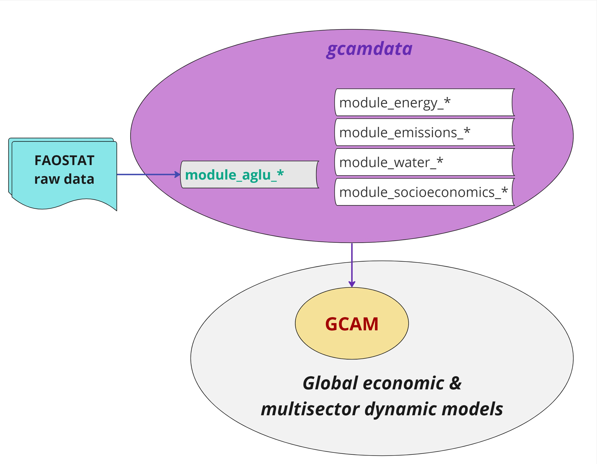
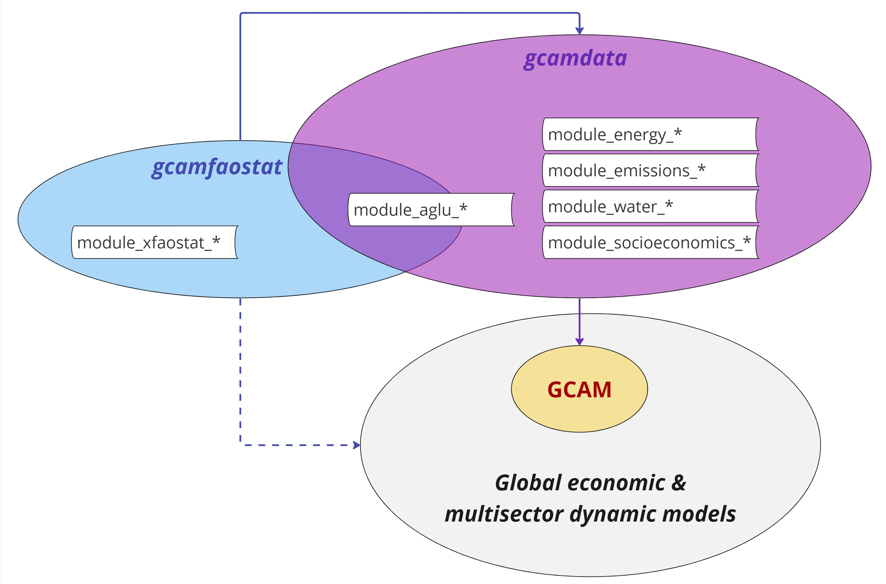

```{r setup, include = FALSE}
knitr::opts_chunk$set(
  collapse = TRUE,
  comment = "#>"
)
```

## Contents 
* [Introduction](#Introduction)
* [The gap gcamfaostat fills](#Gap)
* [Installing gcamfaostat](#Install)
* [Run the driver](#Driver)
* [References](#References)


## Introduction <a name="Introduction"></a>  

Global economic and multisector dynamic models have become pivotal tools for investigating complex interactions between human activities and the environment, as evident in recent research [@Doelman2022Quantifying;@Fujimori2022Land-based;@IPCC2022Annex;@Ven2023multimodel]. Agriculture and land use (AgLU) plays a critical role in these models, particularly when used to address key agroeconomic questions [@Graham2023Agricultural;@Yarlagadda2023Trade;@Zhang2023Agriculture;@Zhao2021Global;@Zhao2020critical]. Sound economic modeling hinges significantly upon the accessibility and quality of data [@Bruckner2019FABIO;@Calvin2022GMD;@Chepeliev2022JGEA]. The Food and Agriculture Organization Statistis (FAOSTAT) [@FAOSTAT2023FAOSTAT] serves as one of the key global data sources, offering open-access data on country-level agricultural production, land use, trade, food consumption, nutrient content, prices, and more. However, the raw data from FAOSTAT requires cleaning, balancing, and synthesis, involving assumptions such as interpolation and mapping, which can introduce uncertainties. In addition, some of the core datasets reported by FAOSTAT, such as FAO’s Food Balance Sheets (FBS), are compiled at a specific level of aggregation, combining together primary and processed commodities (e.g., wheat and flour), which creates additional data processing challenges for the agroeconomic modeling community [@Chepeliev2022JGEA]. It is noteworthy that each agroeconomic modeling team typically develops its own assumptions and methods to prepare and process FAOSTAT data [@bond2019gcamdata]. While largely overlooked, the uncertainty in the base data calibration approach likely contributed to the disparities in model outcomes [@Lampe2014AgMIP;@zhao2021role]. Hence, our motivation is to create an open-source tool (**`gcamfaostat`**) for the preparation, processing, and synthesis of FAOSTAT data for global agroeconomic modeling. The tool can also be valuable to a broader range of users interested in understanding global agriculture trends and dynamics, as it provides accessible and processed data and [visualization](https://jgcri.github.io/gcamfaostat/articles/vignette_visualization.html) functions.

*** 

## The gaps **`gcamfaostat`** fills <a name="Gap"></a>  

[**Figure 1**](#Fig1) shows a standard framework of using FAOSTAT data in GCAM. GCAM is a widely recognized global economic and multisector dynamic model complemented by the gcamdata R package, which serves as its data processing system. Particularly, gcamdata includes modules (data processing chunks) and functions to convert raw data inputs into hundreds of XML files needed by GCAM [@bond2019gcamdata]. As an illustration, in the latest GCAM version, GCAM v7 [@bond_lamberty_2023], about 280 XML files, with a combined size of 4.1 GB, are generated. Although AgLU-related XMLs represent only about 10% of the total number of files, they contribute over 50% in size (~2.1 GB). The majority of AgLU-related data, whether directly or indirectly, rely on raw data sourced from the FAOSTAT. 

Nonetheless, the FAOSTAT data employed within gcamdata has traditionally involved manual downloads and may have undergone preprocessing. In light of the increasing data needs, maintaining the FAOSTAT data processing tasks in gcamdata has become increasingly challenging. In addition, the processing of FAOSTAT data in the AgLU modules of gcamdata is tailored specifically for GCAM. Consequently, the integration of FAOSTAT data updates has proven to be a non-trivial task, and the data processed by the AgLU module has limited applicability in other modeling contexts [@zhao_cmp360]. The **`gcamfaostat`** package is aimed to address these limitations ([**Figure 2**](#Fig2)). The targeted approach incorporates data preparation, processing, and synthesizing capabilities within a dedicated package, gcamfaostat, while regional and sectoral aggregation functions in the model data system are implemented using standalone routines within the gcamdata package. This strategy not only ensures the streamlined operation of **`gcamfaostat`** but also contributes to keeping model data system lightweight and more straightforward to maintain.  
  
<br />
 <a name="Fig1"></a>
<center>
{width=70%}  
</center>
**Figure 1**. The original framework of utilizing FAOSTAT data in GCAM and similar large-scale models. Note that FAOSTAT data is mainly processed in the AgLU modules in gcamdata while there could be interdependency across data processing modules.  

<br />
<a name="Fig2"></a> 
<center>
{width=70%} 
</center>
**Figure 2**. The new framework of utilizing FAOSTAT data in GCAM and similar large-scale models through gcamfaostat. Modules with identifier _xfaostat_ only exist in gcamfaostat. The AgLU-related modules (_aglu_) that rely on outputs from gcamfaostat can run in both packages. Other gcamdata modules that process data in such areas as energy, emissions, water, and socioeconomics only exist in gcamdata.

***

## Installing `gcamfaostat` <a name="Install"></a>  

####  R

* R version 4.0 or higher and RStudio are recommended. 

#### Clone this repository

* On the command line: navigate to your desired folder location and then enter `git clone https://github.com/JGCRI/gcamfaostat.git` 

* If using GitHub Desktop: Go to https://github.com/jgcri/gcamfaostat and click the green "Code" button. Then click "Open with GitHub Desktop".

#### Loading the `gcamfaostat` package

* Open the `gcamfaostat` folder you just cloned and double-click the `gcamfaostat.Rproj` file. RStudio should open the project.

* If you have not installed `devtools` before, first enter the following into the R console  
```{r eval = FALSE}
install.packages("devtools")
```

* Then to load the `gcamfaostat` package:

```{r eval = FALSE}
devtools::load_all()
```

#### Package dependencies
* You may also need to install package dependencies, for example using:
```R
devtools::install_deps()
```
* Note that could be issues with some recent package dependencies. Users can consider using `renv`. 

  * `renv` is an R package for dependency management. 
  * Using it will save a private R library with the correct versions of any package dependencies. 
  * Please find more details [here](https://jgcri.github.io/gcamdata/articles/getting-started/getting-started.html#optional-renv-currently-included-in-gcam-6-0-and-gcamdata-release) in `gcamdata` manual.


## Run the driver <a name="driver"></a>  
#### `driver_drake` and `driver`
Users should now be ready to run the driver, which is the main processing function that generates intermediate data outputs and final output (csv or other files) for `GCAM` (`gcamdata`) or other models. Driver functions will run data processing modules/functions sequentially, see [Processing Flow](https://jgcri.github.io/gcamfaostat/articles/vignette_processing_flow.html). There are two ways to run the driver, both inherited  from `gcamdata`.

1. `driver_drake()`

`driver_drake()` runs the driver and stores the outputs in a hidden cache. When you run `driver_drake()` again it will skip steps that are up-to-date. This is useful if you will be adjusting the data inputs and code and running the data system multiple times. For this reason, we almost always recommend using `driver_drake()`. More details can be found in the [here](https://jgcri.github.io/gcamdata/articles/driverdrake_vignette.html).

2. `driver()`  

See [here](https://jgcri.github.io/gcamdata/reference/driver.html) for more options when running the driver, such as what outputs to generate or when to stop.

For `gcamfaostat`, it is recommended to use `driver_drake()` so the data tracing and exploring after the drive will be possible, even thought it may take longer to run and additional space (for drake cache) compared to `driver()`. 

#### Output files  
* In `constants.R`, users can set `OUTPUT_Export_CSV == TRUE` and specify the output directory (`DIR_OUTPUT_CSV`) to export and store the output csv files. 
* The default directory is `outputs/gcamfaostat_csv_output`.
* Users can also make use of the functions to trace the processing by step, when`driver_drake()` is employed.  


## References <a name="References"></a>  
