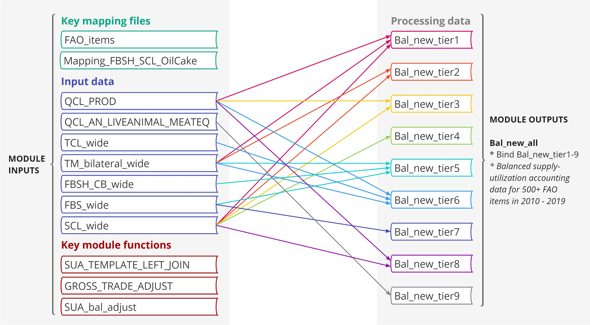

```{r setup, include = FALSE}
knitr::opts_chunk$set(
  collapse = TRUE,
  comment = "#>"
)
```


## Data processing

### Module structure

The architecture of gcamfaostat processing modules is depicted in the [**Figure 1**](#Fig1) below. This framework currently comprises eight preprocessing modules and nine processing and synthesizing modules, generating twelve output files tailored for
[GCAM v7](https://github.com/JGCRI/gcam-core/releases/tag/gcam-v7.0). Each module is essentially an `R` function with well-defined inputs and outputs. To showcase the flexibility and expandability of our package, we also incorporated two AgLU modules (from `gcamdata`) that exemplify the data aggregation processes, e.g., across regions, sectors, and time. Moreover, the `driver_drake` function plays a pivotal role by executing all available data processing modules, thereby generating both intermediate and final outputs, which are vital components of our comprehensive data processing pipeline.  
<br />

 <a name="Fig1"></a>
{width=98%}
**Figure 1. The architecture of data processing modules in gcamfaostat** 

### Data synthesizing in a key module

Of particular significance is the `module_xfaostat_L105_DataConnectionToSUA`, which plays a pivotal role in harmonizing various FAOSTAT datasets to generate a cohesive set of agricultural supply and utilization accounts (SUA) data. This complex process is elucidated in the following [**Figure 2**](#Fig2). This endeavor entails working through nine tiers of data, each sourced differently, with the aim of producing an harmonized agricultural SUA dataset for over 500 agricultural commodities. Compared to the FAO’s FBS, which report food and nutritional information for about 100 composite categories, in many cases combining primary and processed commodities (e.g., wheat and flour) within a single category (e.g., wheat and products), the constructed SUA explicitly trace the transformations between primary and processed commodities, while reporting nutritional details at a highly disaggregated level (over 500 commodities). In doing so, the constructed dataset substantially simplifies the FAOSTAT data processing steps by explicitly distinguishing food and nutritional supply at the individual commodity level and facilitating a straightforward mapping of the corresponding data to the global agroeconomic models.

As an illustrative example, the first tier comprises 168 commodities, generated by combining production data from QCL, trade data from TM, and other essential balancing elements (such as opening and closing stocks, food and feed uses, and other industrial uses) from SCL. For a more comprehensive understanding of these procedures, we encourage an interested user to explore the mapping file, FAO_items. It is crucial to underscore the importance of these processing procedures, as raw FAOSTAT data often contains duplicated elements and inconsistencies among different datasets. For instance, trade data can be found in TCL, TM, SCL, and FBS, while production data exists in QCL and SCL. 
<br />
<a name="Fig2"></a>  
{width=98%}  
**Figure 2. FAOSTAT agricultural supply utilization data synthesis in module_xfaostat_L105_DataConnectionToSUA.** Note that the nine tiers of data, distinguished by commodities (or items in FAOSTAT terms) included, have different sources for generating agricultural supply utilization accounts.  

### driver_drake

[`driver_drake`](https://jgcri.github.io/gcamfaostat/reference/driver_drake.html) 

* The function runs data processing modules sequentially to generate intermediate data outputs and final output (e.g., csv or other files) for GCAM (gcamdata) or other models.
* The function is inherited from gcamdata and it uses the drake [@Landau2018] pipeline framework, which simplifies module updates, data tracing, and results visualization process. 
* It stores the outputs in a drake cache so that when the function is run again, it skips the steps that are up-to-date.
* In constants.R, users can set OUTPUT_Export_CSV = TRUE and specify the output directory (`DIR_OUTPUT_CSV`) to export and store the output csv files (currently the default option for GCAM v7).


***

##	Data tracing

### Key functions

As gcamfaostat is built upon the foundation of `gcamdata` and leverages the powerful drake framework, inheriting functions designed for tracking data flows. In the following, we will delve into several key features that exemplify the strengths of this integration. 

[`info`](https://jgcri.github.io/gcamfaostat/reference/info.html) 
* The function returns information of an object, including name, metadata information, precursors and dependents.

[`dstrace`](https://jgcri.github.io/gcamfaostat/reference/dstrace.html)
* The function is able to trace data flows by providing precursors and dependents of an object recursively.

[`load_from_cache`](https://jgcri.github.io/gcamfaostat/reference/load_from_cache.html)
*	If a drake cache is available, e.g., when `driver_drake()` had been run, this function, if given a list of object names, loads the objects from the cache into a list of data frames.  
*	The function [`get_data_list`](https://jgcri.github.io/gcamfaostat/reference/get_data_list.html) can be used to assign each object in the list to a data frame.  


### Examples

``` {r, eval =TRUE, message = FALSE, warnings = FALSE, error = FALSE}
# Load gcamfaostat
# devtools::load_all() 
library(gcamfaostat)
# package data, GCAM_DATA_MAP, will be loaded

# Get information for an intermediate data frame QCL_CROP_PRIMARY
info("QCL_CROP_PRIMARY")

# Trace all downstream data flows for SCL_wide
dstrace("SCL_wide", direction = "downstream", recurse = T) 

# Get input of a module
inputs_of("module_xfaostat_L105_DataConnectionToSUA")

# Get output of a module
outputs_of("module_xfaostat_L106_FoodMacroNutrient")
```

``` {r, eval =FALSE}
# Not evaluated for convenience 
# Load gcamfaostat
devtools::load_all() 
devtools::load_all() 

# Load FAO_items from cache
load_from_cache("aglu/FAO/FAO_items") %>% first() -> FAO_items
# Print
head(FAO_items)

# Define a list of input data
MODULE_INPUTS <- c("Bal_new_all")
# Load a list of MODULE_INPUTS from cache and assign to their name
get_data_list(all_data = load_from_cache(MODULE_INPUTS), data_list = MODULE_INPUTS)
# Print
head(Bal_new_all)
```


## References
