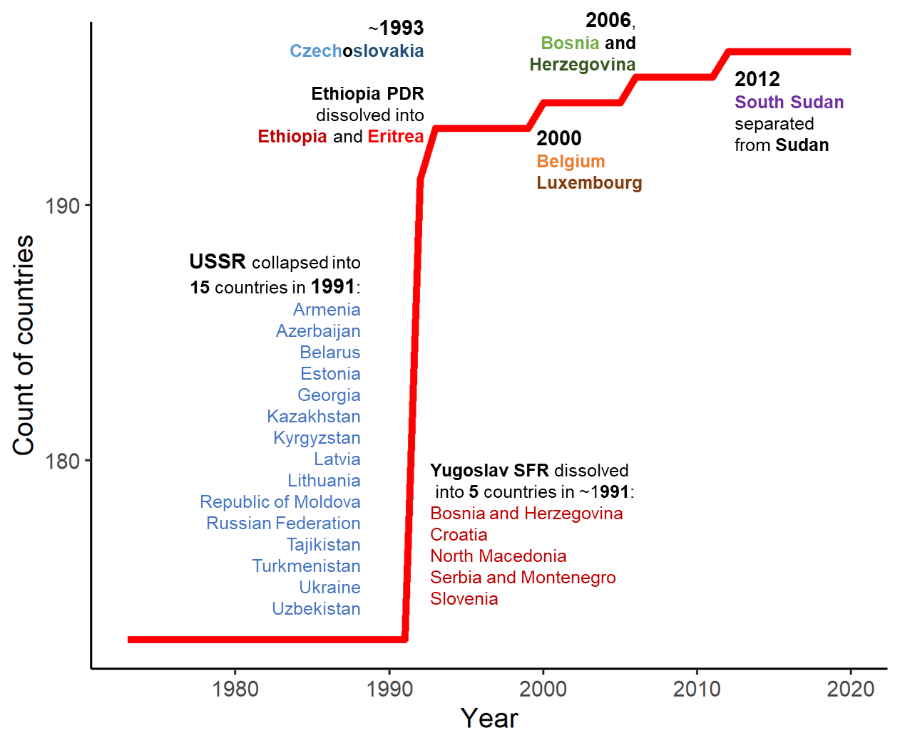
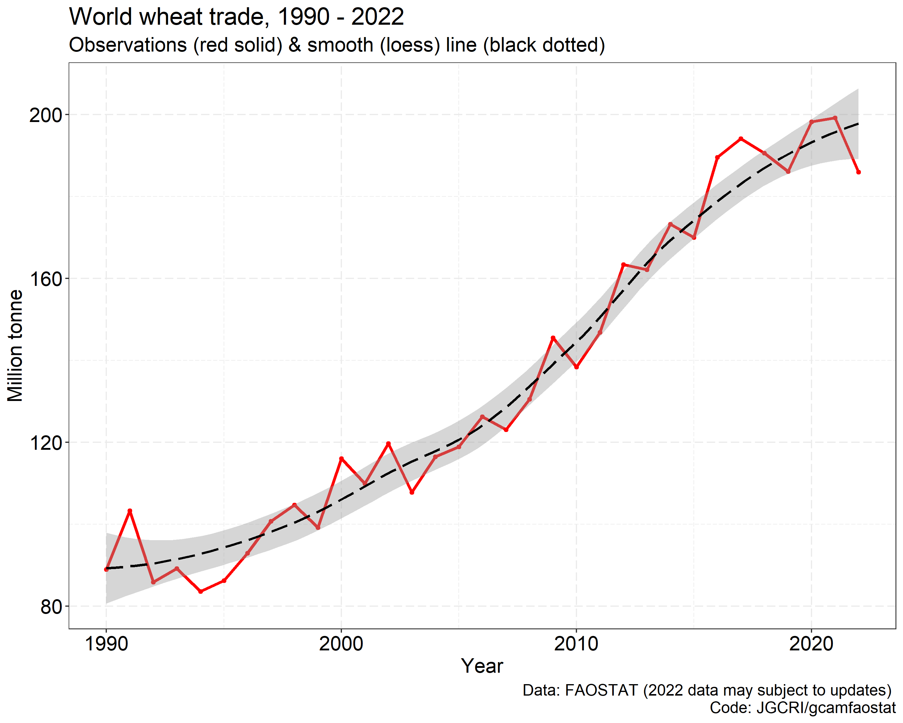
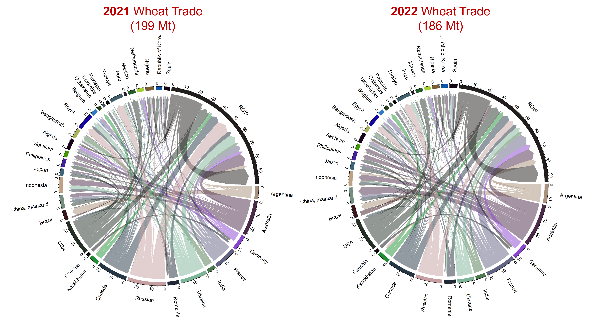
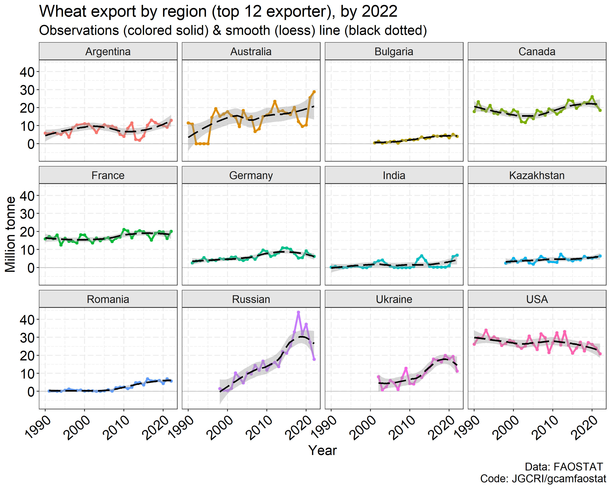
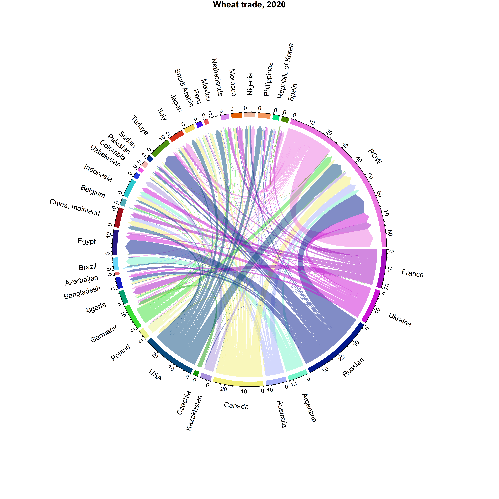

```{r setup, include = FALSE}
knitr::opts_chunk$set(
  collapse = TRUE,
  comment = "#>"
)
```


**This page describes additional functions and capabilities of `gcamfaostat`**. Users are also encouraged to check out `gcamdata` online manual, e.g., [data system changes](https://jgcri.github.io/gcamdata/articles/changing-the-data-system/index.html) and
[user modification](https://jgcri.github.io/gcamdata/articles/usermod_vignette.html) for additional examples for modifying modules. 


## FAOSTAT raw data and processing output updates

To update the output data by including new data years, e.g., for model base year updates, the user needs to implement the following steps:  
  
1. Download the latest FAOSTAT data using the `FF_download_FAOSTAT` function.  
2. In the configuration file (`R/constants.R`), adjust the year variables and set `Process_Raw_FAO_Data` to `TRUE`.
3. If more recent data is available the maximum year in `FAOSTAT_Hist_Year_*` can be updated accordingly.  
4. Verify and update the output formats and names in the data exporting modules.
5. Execute the `driver_drake` function to initiate the data processing.


## Adding new data processing modules

Any R files located in the `R` folder, as long as they adhere to the module format with clearly defined module inputs and outputs, will be automatically detected by the driver and `driver_drake` functions. These functions establish a data map that dictates the sequence of data processing, ensuring that modules are executed in the correct order. Consequently, the process of adding a new module to the system is straightforward:

1. Create a new module script, following the examples of existing modules.  
2. Define the inputs and outputs, and incorporate your data processing code.
3. If the module requires new datasets from FAOSTAT, include the dataset code in `gcamfaostat_metadata` and use functions like `FF_download_FAOSTAT` or `FF_rawdata_info` to download the necessary data.
4. Execute the `driver_drake` function.  
5. Modified `generate_package_data.R` when Prebuilt data changes are needed.  


## Generating output for new agroeconomic models

If all the necessary FAOSTAT raw data is already incorporated into gcamfaostat, users can directly produce output for a new agroeconomic model. This can be achieved by either adding an output exporting module (e.g., `module_xfaostat_L199_CSVExportAgSUA`) or adapting an existing module (e.g., `module_xfaostat_L201_Forestry`) to export data in the required format. Notably, gcamfaostat presently includes a function, `output_csv_data`, for exporting data to CSV files. Additionally, users have the flexibility to expand the functionality by incorporating new functions to export data in alternative formats as needed. In cases when the required data is not readily available, users should proceed by introducing new processing modules.  


***

## Country aggregation and disaggregation

Since the 1970s, the number of countries in the world has increased due to the dissolution of regions. In other words, when a region dissolves, the country associated with it ceases to exist, and new countries emerge in its place, see [**Figure 1**](FigCountryChange). We included functions to deal with changes in the country classifications. Note the functions rely on the `area_code` ID included in FAO dataset. They are also consistently defined in the function. 

 

[`FAOSTAT_AREA_RM_NONEXIST`](https://jgcri.github.io/gcamfaostat/reference/FAOSTAT_AREA_RM_NONEXIST.html)  

* The function removes nonexistent FAO regions using area_code, e.g., USSR after 1991.  
* All nonexistent countries due to dissolution are removed by default.  
* Small regions/areas with low data quality can also be removed using this function.  

[`FAO_AREA_DISAGGREGATE_HIST_DISSOLUTION_ALL`](https://jgcri.github.io/gcamfaostat/reference/FAO_AREA_DISAGGREGATE_HIST_DISSOLUTION_ALL.html) 
  
* The function disaggregates regions into smaller countries.  
* All dissolved regions (since 1970s) are disaggregated in historical periods (before dissolution) based on the data after dissolution.

<a name="FigCountryChange"></a>  
<center>
{width=70%} 
</center>

## Other helper functions

[`FF_FILL_NUMERATOR_DENOMINATOR`](https://jgcri.github.io/gcamfaostat/reference/FF_FILL_NUMERATOR_DENOMINATOR.html) 
  
* A function to fill in missing values with the consideration of the relationship between two variables.

[`Moving_average`](https://jgcri.github.io/gcamfaostat/reference/Moving_average.html) 
  
* A function to calculate moving average given an odd number of the periods.

[`rm_accent`](https://jgcri.github.io/gcamfaostat/reference/rm_accent.html) 
  
* A function to remove accent and apostrophe for columns in a data frame.

[`output_csv_data`](https://jgcri.github.io/gcamfaostat/reference/rm_accent.html) 
  
* A function to save data frames to csv files with desired header information.
* The output can be read into gcamdata directly.

***

## Case study: wheat bilateral trade pattern changes

* The world wheat trade was affected by the Russian-Ukraine war in 2022 (see Figures below).
* In 2021 vs. 2020, Russian wheat export already dropped by ~30% (+7% for Ukraine), but plummeted another 35% (-42% for Ukraine) in 2022. 
* In the same time, USA and Canada, major wheat supplier was hit by weather shocks and production plummeted.  
* Trade changes are certainly more complicated. The war was not the only driver, as Canada and US also had a drop in export. But Argentina, Australia, and even India supplied more to the world market.
* Egypt took the largest hit. But the variation was not extreme for most major importers. 
See that smile curve in China.
* The world trade took a hit (-6%), but the overall pattern didn't change drastically in just 1 year.

 

{width=100%}
{width=100%}
{width=100%}
{width=100%}

```{r, eval = FALSE}
devtools::load_all()
library(circlize)
library(ggplot2)

# Download the latest TM (bilateral trade) from FAOSTAT
# To the path specified in DIR_RAW_DATA_FAOSTAT (see constants.R)

FF_download_FAOSTAT(DATASETCODE = "TM",
                    DATA_FOLDER = file.path("..",DIR_RAW_DATA_FAOSTAT),
                    OverWrite = TRUE)

# We could use module_xfaostat_L101_RawDataPreProc6_TM to clean and process the data
# But here we visualize the raw data directly for continence (TM data is huge)
# and also because the updates will be included later  

# Load raw data 
# Date 10-31-2023
FAOSTAT_load_raw_data(DATASETCODE = "TM", 
                      DATA_FOLDER = file.path("..",DIR_RAW_DATA_FAOSTAT))


TM %>%
  filter(year %in% c(2020:2022),
         item_code == 15, # Wheat
         element %in% c("Export Quantity")) %>% 
    select(source = reporter_countries,
           area = partner_countries, item, 
           element, year, value, unit) ->
  TM_Wheat

TM_Wheat %>% 
  rm_accent("area", "source") %>% 
  mutate(value = value / 1000000) %>%  #Mt
  mutate(area = replace(area, area == "United States of America", "USA")) %>% 
  mutate(area = replace(area, area == "United Arab Emirates", "UAE")) %>% 
  mutate(area = replace(area, area == "Democratic Republic of the Congo", "DR Congo")) %>% 
  mutate(area = gsub(" Federation| of Great Britain and Northern Ireland| Province of| \\(Bolivarian Republic of\\)|United Republic of | \\(Islamic Republic of\\)|\\(Kingdom of the\\)", "", area)) %>% 
  mutate(source = replace(source, source == "United States of America", "USA")) %>% 
  mutate(source = replace(source, source == "United Arab Emirates", "UAE")) %>% 
  mutate(source = replace(source, source == "Democratic Republic of the Congo", "DR Congo")) %>% 
  mutate(source = gsub(" Federation| of Great Britain and Northern Ireland| Province of| \\(Bolivarian Republic of\\)|United Republic of | \\(Islamic Republic of\\)|\\(Kingdom of the\\)", "", source)) %>% 
  select(REG_ex = source, REG_im = area, flow = value, year) ->
  TM_Wheat_1

# focus on key players
TM_Wheat_1 %>% filter(year == 2021) %>% top_n(35, flow) %>% 
  select(REG_ex, REG_im) %>% unlist %>% 
  unique() -> KeyPlayers

TM_Wheat_1 %>% 
  mutate(REG_ex = replace(REG_ex, !REG_ex %in% KeyPlayers, "ROW")) %>% 
  mutate(REG_im = replace(REG_im, !REG_im %in% KeyPlayers, "ROW")) %>%
  # aggregate small players 
  group_by(REG_ex, REG_im, year) %>% 
  summarise(flow = sum(flow), .groups = "drop") ->
  dat_circular

dat_circular %>% group_by(year) %>% summarise(flow = sum(flow))


# Get color
GridColor <- rand_color(length(KeyPlayers) + 1) 

# Plot 

chord_wrapper(.DF = dat_circular %>% filter(year == 2022) %>% select(-year)%>% arrange(REG_ex, REG_im),
              .GRIDCOLOR = GridColor,
              .FigTitle = "Wheat trade, 2022",
              .ORDER = c(KeyPlayers, "ROW"),
              .SaveDir = "../man/figures",
              .SaveName = "Fig_WheatTrade2022")

chord_wrapper(.DF = dat_circular %>% filter(year == 2021) %>% select(-year)%>% arrange(REG_ex, REG_im),
              .GRIDCOLOR = GridColor,
              .FigTitle = "Wheat trade, 2021",
              .ORDER = c(KeyPlayers, "ROW"),
              .SaveDir = "../man/figures",
              .SaveName = "Fig_WheatTrade2021")

chord_wrapper(.DF = dat_circular %>% filter(year == 2020) %>% select(-year) %>% arrange(REG_ex, REG_im),
              .GRIDCOLOR = GridColor,
              .FigTitle = "Wheat trade, 2020",
              .ORDER = c(KeyPlayers, "ROW"),
              .SaveDir = "../man/figures",
              .SaveName = "Fig_WheatTrade2020")
    

# Quickly adding time-series
TM_Wheat_1 %>% 
  group_by(REG_ex, year) %>% 
  summarize(value = sum(flow)) %>% ungroup() %>% 
  filter(year == 2021) %>%arrange(value) %>% top_n(12, value) %>% 
  pull(REG_ex) -> KeyPlayers_exporter

TM_Wheat_1 %>% 
  group_by(REG_im, year) %>% 
  summarize(value = sum(flow)) %>% ungroup() %>% 
  filter(year == 2021) %>%arrange(value) %>% top_n(12, value) %>% 
  pull(REG_im) -> KeyPlayers_importer

TM_Wheat_1 %>% 
  group_by(year) %>% 
  summarize(value = sum(flow)) %>% ungroup() %>% 
  ggplot(aes(x = year, y = value)) +
  #geom_hline(yintercept = 0, size = 0.4, color = "grey") +
  geom_line(aes(x = year, y = value), color = "red", size = 1.2) +
  geom_point(size = 1.4, color = "red") +
  geom_smooth(linetype = 5, #method = "lm", 
              color = "black", size = 1) +
  theme_bw() + 
  labs(y = "Million tonne", x = "Year",
       title = "World wheat trade, 1990 - 2022", 
       subtitle = "Observations (red solid) & smooth (loess) line (black dotted) ",
       caption = "Data: FAOSTAT (2022 data may subject to updates) \n Code: JGCRI/gcamfaostat") +
  theme(text = element_text(size = 16),
        panel.grid = element_line(linetype = 5),
        axis.text = element_text(colour = "black", size = 16),
        #axis.text.x = element_text(angle = 40, hjust = 1, vjust = 1),
        strip.background = element_rect(fill = "grey90"),
        legend.position = "none") -> p;p

ggsave(file.path("../man/figures", "Fig_WheatTradeWorldby2022.png"), p, width = 10, height = 8)


TM_Wheat_1 %>% 
  filter(REG_ex %in% KeyPlayers_exporter ) %>% 
  group_by(REG_ex, year) %>% 
  summarize(value = sum(flow)) %>% ungroup() %>% 
  ggplot(aes(x = year, y = value, group = REG_ex, color = REG_ex)) + facet_wrap(~REG_ex) + 
  geom_hline(yintercept = 0, size = 0.4, color = "grey") +
  geom_line(aes(x = year, y = value, group = REG_ex, color = REG_ex), size = 1.2) +
  geom_point(size = 1.4) +
  geom_smooth(linetype = 5, #method = "lm", 
              color = "black", size = 1) +
  theme_bw() + 
  labs(y = "Million tonne", x = "Year",
       title = "Wheat export by region (top 12 exporter), by 2022", 
       subtitle = "Observations (colored solid) & smooth (loess) line (black dotted) ",
       caption = "Data: FAOSTAT \n Code: JGCRI/gcamfaostat") +
  theme(text = element_text(size = 16),
        panel.grid = element_line(linetype = 5),
        axis.text = element_text(colour = "black", size = 16),
        axis.text.x = element_text(angle = 40, hjust = 1, vjust = 1),
        strip.background = element_rect(fill = "grey90"),
        legend.position = "none") -> p

ggsave(file.path("../man/figures", "Fig_WheatExportby2022.png"), p, width = 10, height = 8)

TM_Wheat_1 %>% 
  filter(REG_im %in% KeyPlayers_importer ) %>% 
  group_by(REG_im, year) %>% 
  summarize(value = sum(flow)) %>% ungroup() %>% 
  ggplot(aes(x = year, y = value, group = REG_im, color = REG_im)) + facet_wrap(~REG_im) + 
  geom_hline(yintercept = 0, size = 0.4, color = "grey") +
  geom_line(aes(x = year, y = value, group = REG_im, color = REG_im), size = 1.2) +
  geom_point(size = 1.4) +
  geom_smooth(linetype = 5, #method = "lm", 
              color = "black", size = 1) +
  theme_bw() + 
  labs(y = "Million tonne", x = "Year",
       title = "Wheat import by region (top 12 importer), by 2022", 
       subtitle = "Observations (colored solid) & smooth (loess) line (black dotted) ",
       caption = "Data: FAOSTAT \n Code: JGCRI/gcamfaostat") +
  theme(text = element_text(size = 16),
        panel.grid = element_line(linetype = 5),
        axis.text = element_text(colour = "black", size = 16),
        axis.text.x = element_text(angle = 40, hjust = 1, vjust = 1),
        strip.background = element_rect(fill = "grey90"),
        legend.position = "none") -> p

ggsave(file.path("../man/figures", "Fig_WheatImportby2022.png"), p, width = 10, height = 8)


```

* Preview  
{width=20%}
{width=20%}

