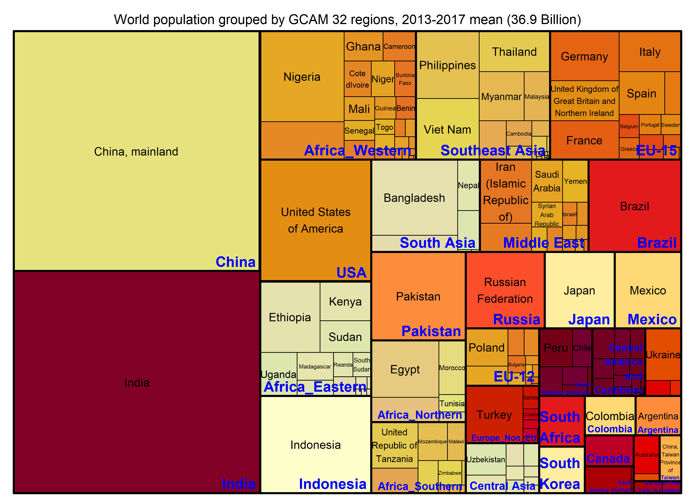
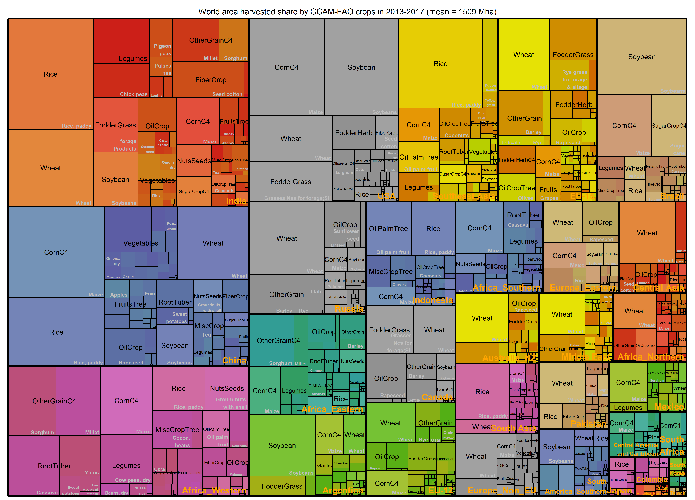

```{r, include = FALSE}
knitr::opts_chunk$set(
  collapse = TRUE,
  comment = "#>"
)
```

# Population

{width=100%}

***  

# Harvested area  

{width=100%}
{width=100%}

***
# Code for generating figures

## 1. Load package data

* Load gcamfaostat locally, assuming driver_drake() was run so that data can be loaded from cache.
``` {r, , eval =FALSE}

devtools::load_all() 
# Load other libraries
library(ggplot2)
library(dplyr)
library(treemap)
library(RColorBrewer)

## Define input data needed ----
MODULE_INPUTS <-
  c(FILE = "aglu/FAO/FAO_ag_items_PRODSTAT",
    FILE = "common/GCAM_region_names",
    FILE = "common/iso_GCAM_regID",
    FILE = "aglu/AGLU_ctry",
    "QCL_CROP_PRIMARY",
    "QCL_FODDERCROP",
    "OA")

```

* To get more information of the input data and trace their use in the package, use `info` or `dstrace` function. They are functions inherited from `gcamdata` for tracing data processing flows.
``` {r, eval =FALSE}
# For example
info("QCL_CROP_PRIMARY")
dstrace("common/iso_GCAM_regID")
```

* Load the data defined in `MODULE_INPUTS` from drake cache
``` {r, eval =FALSE}
# Load the data to all_data as a list
MODULE_INPUTS %>% load_from_cache() -> all_data
# Assign the data items to their names as data frames
get_data_list(all_data, MODULE_INPUTS, strip_attributes = TRUE)

```

* Define a base year period for visualizing cross-sectional data. The mean value will be used (2015 is *GCAM v7* base year)
``` {r, eval =FALSE}
BaseYear <- c(2013:2017)
```

## 2. Helper functions
``` {r, eval =FALSE}
# Wrapper of treemap
treemap_wrapper <- function(.DF,            # .DF need to have the value col
                           .Depth = 2,     # Grouping depth of the tree; the columns will be used
                           .Palette = "Set2", # color
                           .FigTitle,      # figure title
                           .SaveName, 
                           .SaveScaler = 1){
  
  assertthat::assert_that(is.data.frame(.DF))
  assertthat::assert_that(is.character(.SaveName))
  assertthat::assert_that(is.character(.FigTitle))
  assertthat::assert_that(.Depth%%1==0)
  assertthat::assert_that(is.numeric(.SaveScaler))
  
  
  # treemap save to a path
  png(filename= file.path("man", "figures", paste0(.SaveName,".png")),res = 300, width= 2500 * .SaveScaler, height= 1800 * .SaveScaler )
  # treemap
  treemap(.DF,
          index= names(.DF)[1:.Depth],
          vSize="value",
          type="index",
          fontsize.labels=c(15,12, 9)[1:.Depth],                # size of labels. Give the size per level of aggregation: size for group, size for subgroup, sub-subgroups...
          fontcolor.labels=c("blue", "black", "grey")[1:.Depth],    # Color of labels
          fontface.labels=c(2,1),                  # Font of labels: 1,2,3,4 for normal, bold, italic, bold-italic...
          bg.labels=c("transparent"),              # Background color of labels
          align.labels=list(
            c("right", "bottom"),
            c("center", "center"),
            c("right", "bottom")
          )[1:.Depth],                                   # Where to place labels in the rectangle?
          overlap.labels=0.1,                      # number between 0 and 1 that determines the tolerance of the overlap between labels. 
          inflate.labels= F,                        # If true, labels are bigger when rectangle is bigger.
          palette = .Palette,                        # Select your color palette from the RColorBrewer presets or make your own.
          title = .FigTitle
  )
  
  dev.off()
}

```
## 3. Population
* Get data ready
``` {r, eval =FALSE}
# simplify population data
OA %>% filter(element_code == 511, item_code == 3010) %>%
  transmute(area, area_code, year, pop = value) %>% 
  filter(year %in% BaseYear) %>% 
  gcamdata::left_join_error_no_match(AGLU_ctry %>% select(area = FAO_country, iso), by = "area") %>%
  gcamdata::left_join_error_no_match(iso_GCAM_regID %>% select(iso, GCAM_region_ID), by = "iso") %>%
  left_join(GCAM_region_names, by = "GCAM_region_ID") -> 
  POP #1000 persons
```
* Plot and save
``` {r, eval =FALSE}
# Figure title
paste0("World population grouped by GCAM 32 regions, ", min(BaseYear), "-", max(BaseYear), " mean (",
       round(POP %>% summarize(value = sum(value) / 1000000),1), " Billion)") -> 
  Title

# Apply wrapper 
treemap_wrapper(
  .DF = POP %>% select(region, area, value), 
  .Depth = 2,
  .Palette = "YlOrRd",
  .FigTitle = Title , 
  .SaveName = "Fig_WorldPopulation", 
  .SaveScaler = 1.2)

``` 
* Preview   
{width=20%}

## 4. Harvested area
* Get data ready
```{r, eval =FALSE}
QCL_CROP_PRIMARY %>% 
  bind_rows(QCL_FODDERCROP) %>% 
  filter(year %in% BaseYear) %>% 
  filter(element == "Area harvested") %>% 
  # Change to Mha
  mutate(value = value / 1000000) %>% select(-unit) %>%
  # the iso mapping in AGLU_ctry works good now
  gcamdata::left_join_error_no_match(AGLU_ctry %>% select(area = FAO_country, iso), by = "area") %>%
  gcamdata::left_join_error_no_match(iso_GCAM_regID %>% select(iso, GCAM_region_ID), by = "iso") %>%
  left_join(GCAM_region_names, by = "GCAM_region_ID") %>%
  group_by(region, item_code, item) %>% 
  # 5-year average
  summarize(value = sum(value) / length(BaseYear), .groups = "drop") %>% 
  ungroup() %>% 
  inner_join(
    FAO_ag_items_PRODSTAT %>%
      filter(!is.na(item), !is.na(GCAM_commodity)) %>%
      select(item_code, GCAM_subsector), by = "item_code") ->
  Tree_Area_Reg_Sector
```

* Plot and save

* Preview   
{width=20%}
{width=20%}

## 5. Supply-utilization

## 6. Trade

## 7. Food calories


