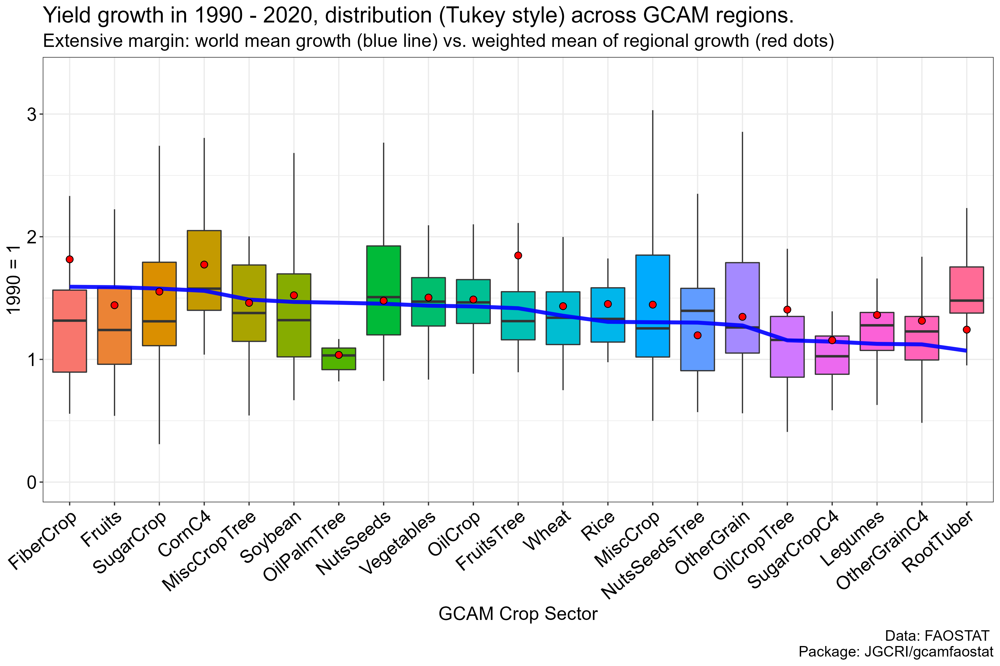

```{r, include = FALSE}
knitr::opts_chunk$set(
  collapse = TRUE,
  comment = "#>"
)
```

***
## Population

{width=100%}

***  

## Harvested area  

{width=100%}
  
  
{width=100%}

***
## Yield growth

{width=100%}


***

## Code for generating figures

### 1. Load package data

* Load gcamfaostat locally, assuming driver_drake() was run so that data can be loaded from cache.
``` {r, , eval =FALSE}

devtools::load_all() 
# Load other libraries
library(ggplot2)
library(dplyr)
library(treemap)
library(RColorBrewer)

## Define input data needed ----
MODULE_INPUTS <-
  c(FILE = "aglu/FAO/FAO_ag_items_PRODSTAT",
    FILE = "common/GCAM_region_names",
    FILE = "common/iso_GCAM_regID",
    FILE = "aglu/AGLU_ctry",
    "QCL_CROP_PRIMARY",
    "QCL_FODDERCROP",
    "OA")

```

* To get more information of the input data and trace their use in the package, use `info` or `dstrace` function. They are functions inherited from `gcamdata` for tracing data processing flows.
``` {r, eval =FALSE}
# For example
info("QCL_CROP_PRIMARY")
dstrace("common/iso_GCAM_regID")
```

* Load the data defined in `MODULE_INPUTS` from drake cache
``` {r, eval =FALSE}
# Load the data to all_data as a list
MODULE_INPUTS %>% load_from_cache() -> all_data
# Assign the data items to their names as data frames
get_data_list(all_data, MODULE_INPUTS, strip_attributes = TRUE)

```

* Define a base year period for visualizing cross-sectional data. The mean value will be used. Note that 2013-2017 is used here since 2015 is the *GCAM v7* base year. However, this can be changed to other year(s)
``` {r, eval =FALSE}
BaseYear <- c(2013:2017)
```

### 2. Population
* Get data ready
``` {r, eval =FALSE}
# simplify population data
OA %>% filter(element_code == 511, item_code == 3010) %>%
  transmute(area, area_code, year, pop = value) %>% 
  filter(year %in% BaseYear) %>% 
  gcamdata::left_join_error_no_match(AGLU_ctry %>% select(area = FAO_country, iso), by = "area") %>%
  gcamdata::left_join_error_no_match(iso_GCAM_regID %>% select(iso, GCAM_region_ID), by = "iso") %>%
  left_join(GCAM_region_names, by = "GCAM_region_ID") -> 
  POP #1000 persons
```
* Plot and save
``` {r, eval =FALSE}
# Figure title
paste0("World population grouped by GCAM 32 regions, ", min(BaseYear), "-", max(BaseYear), " mean (",
       round(POP %>% summarize(value = sum(value) / 1000000),1), " Billion)") -> title

treemap_wrapper(
  .DF = POP %>% select(region, area, value), 
  .Depth = 2,
  .Palette = "YlOrRd", .LastLabelCol = "blue",
  .FigTitle = title, .FigTitleSize = 16, 
  .SaveName = "Fig_WorldPopulation", 
  .SaveScaler = 1.2
)

``` 
* Preview   
{width=20%}

### 3. Harvested area
* Get data ready
```{r, eval =FALSE}
QCL_CROP_PRIMARY %>% 
  bind_rows(QCL_FODDERCROP) %>% 
  filter(year %in% BaseYear) %>% 
  filter(element == "Area harvested") %>% 
  # Change to Mha
  mutate(value = value / 1000000) %>% select(-unit) %>%
  # the iso mapping in AGLU_ctry works good now
  gcamdata::left_join_error_no_match(AGLU_ctry %>% select(area = FAO_country, iso), by = "area") %>%
  gcamdata::left_join_error_no_match(iso_GCAM_regID %>% select(iso, GCAM_region_ID), by = "iso") %>%
  left_join(GCAM_region_names, by = "GCAM_region_ID") %>%
  group_by(region, item_code, item) %>% 
  # 5-year average
  summarize(value = sum(value) / length(BaseYear), .groups = "drop") %>% 
  ungroup() %>% 
  inner_join(
    FAO_ag_items_PRODSTAT %>%
      filter(!is.na(item), !is.na(GCAM_commodity)) %>%
      select(item_code, GCAM_subsector), by = "item_code") ->
  Tree_Area_Reg_Sector
```

* Plot and save
```{r, eval =FALSE}
paste0("World area harvested grouped by GCAM crops, ", min(BaseYear), "-", max(BaseYear), " mean (",
       round(Tree_Area_Reg_Sector %>% summarize(value = sum(value) ),0), " Mha)") -> title

treemap_wrapper(
  .DF = Tree_Area_Reg_Sector %>% select(GCAM_subsector, item, value), 
  .Depth = 2,
  .Palette = "Set2",
  .FigTitle = title, .FigTitleSize = 16, 
  .SaveName = "Fig_WorldAreaHarvested", 
  .SaveScaler = 1.1
)

paste0("World area harvested grouped by GCAM crops and regions, ", min(BaseYear), "-", max(BaseYear), " mean (",
       round(Tree_Area_Reg_Sector %>% summarize(value = sum(value) ),0), " Mha)") -> title

treemap_wrapper(
  .DF = Tree_Area_Reg_Sector %>% select(region, GCAM_subsector, item, value), 
  .Depth = 3,
  .Palette = "Set2",
  .FigTitle = title, .FigTitleSize = 20,
  .SaveName = "Fig_WorldAreaHarvestedReg", 
  .SaveScaler = 1.6
)
```

* Preview   
{width=20%}
{width=20%}

### 4. Yield
* Get data ready
```{r, eval =FALSE}

YieldBaseYear = 1990
QCL_CROP_PRIMARY %>% 
  # disaggregate dissolved regions in history
  FAO_AREA_DISAGGREGATE_HIST_DISSOLUTION_ALL(SUDAN2012_MERGE = T) %>% 
  # the iso mapping in AGLU_ctry works good now
  left_join_error_no_match(AGLU_ctry %>% select(area = FAO_country, iso), by = "area") %>%
  left_join_error_no_match(iso_GCAM_regID %>% select(iso, GCAM_region_ID), by = "iso") %>%
  left_join(GCAM_region_names, by = "GCAM_region_ID") %>% 
  group_by(GCAM_region_ID, region, element, unit, year, item_code) %>% 
  # aggregate to 32 GCAM regions
  summarize(value = sum(value), .groups = "drop") %>% 
  inner_join(
    FAO_ag_items_PRODSTAT %>%
      filter(!is.na(item), !is.na(GCAM_commodity)) %>%
      select(item_code, GCAM_subsector), by = "item_code") %>% 
  group_by_at(vars(GCAM_region_ID, region, GCAM_subsector, year, element)) %>% 
  # Aggregate to GCAM sectors
  summarize(value = sum(value), .groups = "drop") %>% 
  filter(year %in% c(YieldBaseYear, 2020)) %>% 
  spread(element, value) %>%
  filter(`Area harvested` > 0) %>%
  # Calculate regio-sector yield
  mutate(Yield = Production / `Area harvested`) %>%
  gather(element, value, `Area harvested`, Production,  Yield) ->
  Yield_1990_2020_GCAMRegSector

Yield_1990_2020_GCAMRegSector %>% 
  filter(element == "Yield") %>% 
  group_by_at(vars(-year, -value)) %>%
  # Calculate growth rate
  mutate(value = value / first(value)) %>% 
  filter(!is.na(value)) %>%  filter(year != YieldBaseYear) ->
  Yield_1990_2020_GCAMRegSector_Growth

Yield_1990_2020_GCAMRegSector_Growth %>% 
  # Join area to get weight
  left_join_error_no_match(Yield_1990_2020_GCAMRegSector %>% 
                             filter(element == "Area harvested") %>% spread(element, value), 
                           by = c("GCAM_region_ID", "region", "GCAM_subsector", "year")) %>% 
  group_by_at(vars(GCAM_subsector, year)) %>% 
  summarize(value = weighted.mean(value, w = `Area harvested`), .groups = "drop")-> 
  Yield_1990_2020_WorldGCAMSector_Growth_FixdArea

Yield_1990_2020_GCAMRegSector %>% 
  spread(element, value) %>%
  group_by_at(vars(GCAM_subsector, year)) %>% 
  summarize(Production = sum(Production),
         `Area harvested` = sum(`Area harvested`), .groups = "drop") %>% 
  mutate(Yield = Production / `Area harvested`) %>%
  gather(element, value, `Area harvested`, Production,  Yield) %>% 
  filter(element == "Yield") %>% 
  group_by_at(vars(-year, -value)) %>% 
  mutate(value = value / first(value)) %>% 
  filter(!is.na(value)) %>%  filter(year != YieldBaseYear) ->
  Yield_1990_2020_WorldGCAMSector_Growth_ChangingArea

# Order sectors
Yield_1990_2020_WorldGCAMSector_Growth_ChangingArea%>% 
  arrange(-value)  %>% pull(GCAM_subsector) -> SectorRank
```
* Plot and save
```{r, eval =FALSE}
Yield_1990_2020_GCAMRegSector_Growth %>% 
  mutate(GCAM_subsector = factor(GCAM_subsector, levels = SectorRank)) %>%  
  ggplot() + 
  geom_boxplot(aes(x = GCAM_subsector, y = value, fill = GCAM_subsector), outlier.size = -1) +
  geom_line(data = Yield_1990_2020_WorldGCAMSector_Growth_ChangingArea %>% 
              mutate(GCAM_subsector = factor(GCAM_subsector, levels = SectorRank)),
             aes(x = GCAM_subsector, y = value, group = year), color = "blue", size = 1.6, alpha = 0.9 ) +
  geom_point(data = Yield_1990_2020_WorldGCAMSector_Growth_FixdArea,
             aes(x = GCAM_subsector, y = value), fill = "red", size = 2.5, shape = 21, color = "black" ) +
  scale_y_continuous(limits = c(0, 3.3)) +
  labs(y = "1990 = 1", x = "GCAM Crop Sector",
       title = "Yield change in 1990 - 2020, distribution (Tukey style) across GCAM regions.", 
       subtitle = "World mean growth (blue line) vs. weighted mean of regional growth (red dots)") +
  theme_bw() + 
  theme(text = element_text(size = 16),
        axis.text = element_text(colour = "black", size = 16),
        axis.text.x = element_text(angle = 40, hjust = 1, vjust = 1),
        strip.background = element_rect(fill = "grey90"),
        legend.position = "none") -> p

ggsave(file.path("man/figures", "WorldYield.png"), p, width = 15, height = 10)

```

* Preview  
{width=20%}

### 5. Supply-utilization

### 5. Trade

### 6. Food calories


